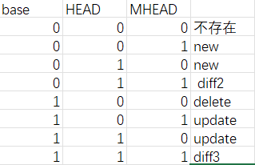

merge: Three-way merge
from:https://www.leshenko.net/p/ugit/#merge-three-way

from:Nikita
two-way-merge:not good enough
three-way-merge:better
The file that need to merge might be present in their common ancestor and it might give us useful context about the merge.

from:leaving_knife
{
'py_diff3.py' 是diff3的python自实现版本，仅用于merge操作而不用于diff。
built by 'Nuitka --onefile py_diff3.py'
在diff中，需要判断equal/delete/insert/replace四种可能的状态。
而在merge中，两个文件中只存在equal（不变）块和modify（改变）块，两种区别。
因此在正式merge两个version之前，需要分别让两个version和Base使用SequenceMatcher，分别生成对应的MBlock list。
每个MBlock list由数个Mblock组成，MBlock('tag', 'basei1', 'basei2', 'content')分别代表一个tag相同的行块，且相邻的MBlock有着不同的tag，因此：每个MBlock list是由交错出现的equal_MBlock和modify_MBlock组成。
同时由于两个version的行数不保证一致，因此每个MBlock通过base的行数('basei1,basei2')来辅助定位。
在实际合并过程中，如果你认为无法合并，那么就交给user合并。
}

{
  when:'.\py_diff3.exe -m versionA base versionB -L HEAD BASE MHEAD'
  ERROR:Error, the program tried to call itself with '-m' argument. Disable with '--no-deployment-flag=self-execution'.
  why:这是因为 Python 解释器通常使用 -m 参数来运行模块作为脚本，而不是直接运行一个文件。
  how?:'.\py_diff3.exe --merge versionA base versionB -L HEAD BASE MHEAD'
}

{

  merge_tree的8种情况
}
